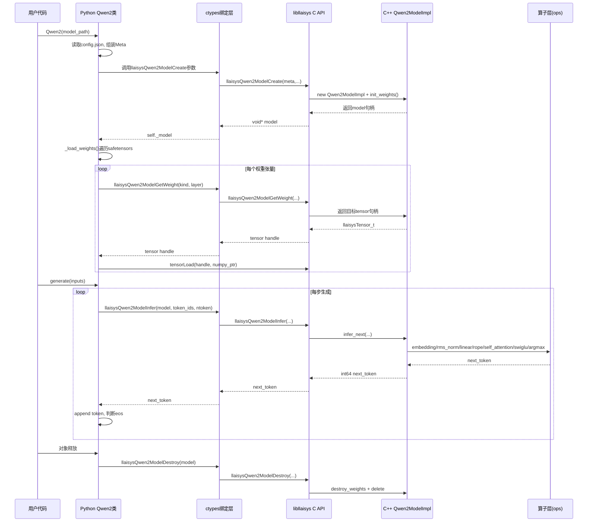

# 任务三：接口层时序图与口述稿（可直接背）

## 1. 一张图看懂调用链

---

## 2. 每一步“为什么要这样设计”

### 2.1 Create/Destroy 一定要成对

- `Create`负责分配：模型对象、每层权重句柄、KV Cache。
- `Destroy`负责释放：否则会有内存泄漏。
- Python有GC，但C++对象不会被Python自动安全释放，所以必须显式提供销毁接口。

### 2.2 GetWeight(kind, layer) 设计成“整数协议”

- Python加载权重时，先把权重名解析成 `kind + layer`。
- C++按这个协议返回目标张量句柄。
- 这样避免跨语言传字符串匹配，接口更稳、成本更低。

### 2.3 Infer 只返回一个 next_token

- 自回归生成本来就是逐步预测。
- 每步返回一个token，便于利用KV Cache增量计算。
- 你的 `generate()` 正是循环调用 Infer 来完成整段文本。

---

## 3. 你代码里的接口对照表

- C头文件定义：include/llaisys/models/qwen2.h
- C++接口实现：src/llaisys/qwen2.cc
- ctypes声明：python/llaisys/libllaisys/models.py
- Python封装入口：python/llaisys/models/qwen2.py

关键函数对应：
- Python `Qwen2.__init__` -> C `llaisysQwen2ModelCreate`
- Python `_load_weights` -> C `llaisysQwen2ModelGetWeight` + `tensorLoad`
- Python `generate` -> C `llaisysQwen2ModelInfer`
- Python `__del__` -> C `llaisysQwen2ModelDestroy`

---

## 4. 复试口述稿（60秒）

我在任务三先设计了稳定的接口层，把模型实现和调用方解耦：
第一步用 `LlaisysQwen2Meta` 统一传入模型结构参数，调用 `llaisysQwen2ModelCreate` 在C++侧分配权重和KV Cache。
第二步通过 `llaisysQwen2ModelGetWeight(kind, layer)` 建立跨语言的权重注入协议，Python把safetensors逐个映射后用 `tensorLoad` 写入后端张量。
第三步生成时，Python循环调 `llaisysQwen2ModelInfer`，C++内部执行完整算子链并利用KV Cache做增量推理，每步返回一个next token。
最后通过 `llaisysQwen2ModelDestroy` 释放所有资源，保证生命周期完整。

---

## 5. 高频追问速答

1) 为什么要 opaque handle（`struct LlaisysQwen2Model;`）？
- 为了隐藏实现细节、稳定ABI、便于后续替换内部实现。

2) 为什么 `Meta` 里放这么多字段？
- 因为后端要按这些字段一次性分配权重形状和缓存形状。

3) 为什么还要 `Weights` 结构体？
- 它是后端参数槽位总表，`GetWeight` 本质就是在这张表里取目标句柄。

4) 为什么不直接 Python 算前向？
- 任务要求核心推理在后端实现，Python只做封装与调度。
